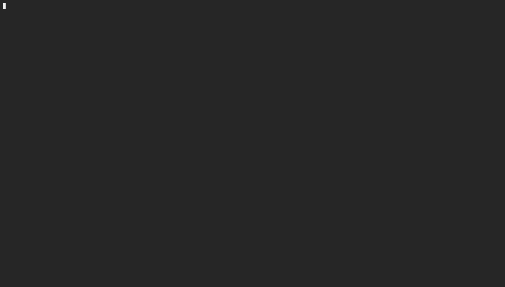

# passgen
Password creator that shuffles the choosen array multiple times before each randomly generated character.



## How to do the thing
Print a 20 character password with full array of QWERTY characters

`python3 passgen -f 20`


Print a 20 character password with array of common special characters: -=./!@#$%*()_?

```python3 passgen -c 20```


**@hup: System was named after the character Hup from The Dark Crystal: Age of Resistance**
